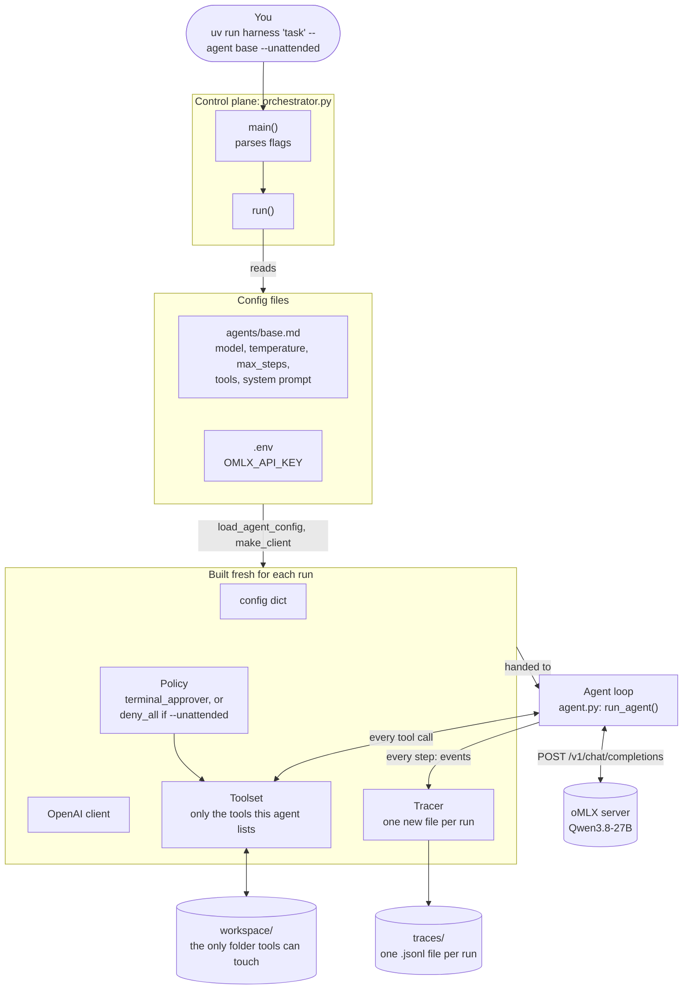
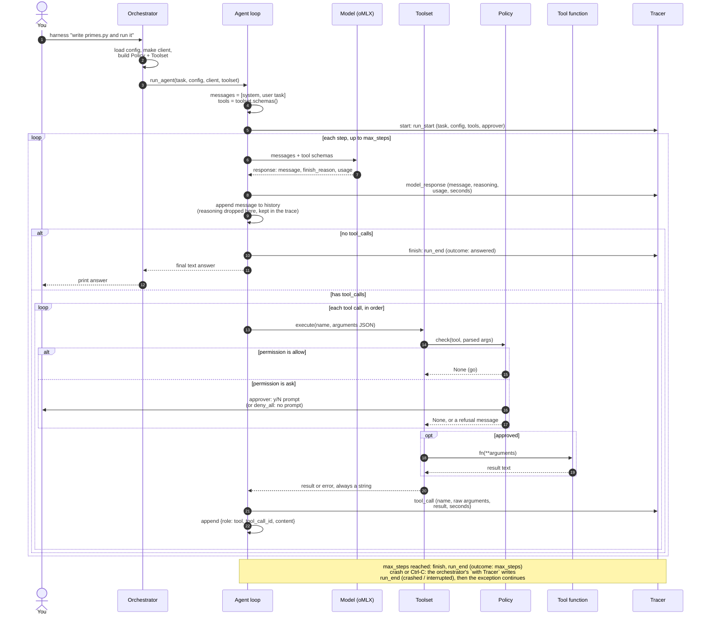
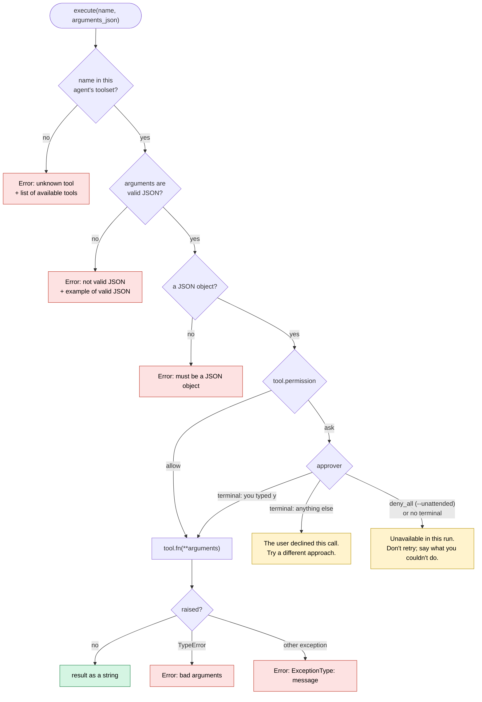
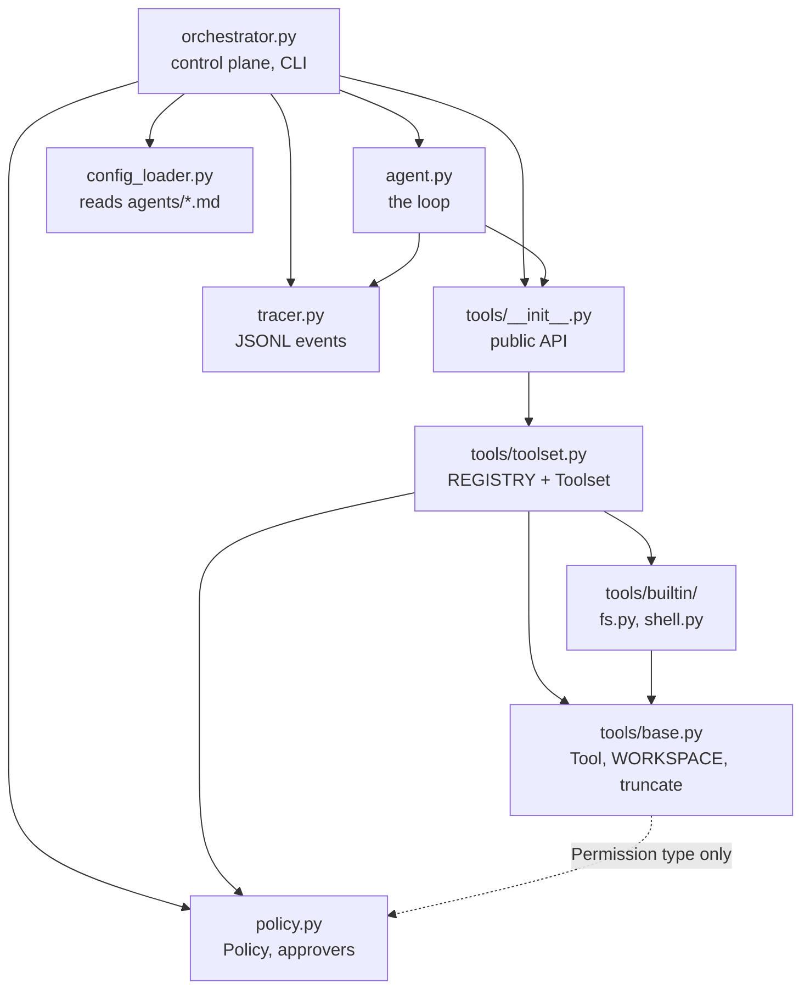

# How the harness works

A picture of the agent as it exists today, kept up to date as the code changes.
Diagrams are [Mermaid](https://mermaid.js.org/), which GitHub renders automatically.

**Last updated:** 2026-10-08, trace logging; trace format defined in tracer.py (on top of commit `ee14bb1`)

---

## 1. The big picture

One command builds everything the agent needs, then hands it over. The orchestrator
wires things together; the agent loop does the work; every tool call passes through
one checkpoint.



---

## 2. One run, step by step

The model is stateless: every turn sends the **whole** conversation. The loop ends
when the model replies without asking for a tool, or when `max_steps` runs out.



---

## 3. Inside `Toolset.execute`: the one checkpoint

Every tool call goes through these checks in order. **Nothing here raises:** each
failure becomes text the model reads next turn, so it can fix its own mistake.
Malformed calls are rejected *before* a human is ever asked.



---

## 4. The tools

| Tool | Permission | What it does | Guardrails |
|---|---|---|---|
| `read_file` | allow | Return a file's text | Paths can't leave `workspace/`; binary/empty files say so; long output truncated (head + tail) |
| `write_file` | allow | Create or overwrite a file | Same path rule; creates parent folders |
| `bash` | **ask** | Run a shell command in `workspace/` | Approval first; stdin closed; timeout kills the whole process group; output truncated; exit code always reported |

An agent only gets the tools its `.md` file lists. A tool it wasn't given can't run,
even if the model invents a call to it.

---

## 5. What the model sees: the conversation grows

From a real run of `"Write primes.py that prints the first 10 primes, run it"`:

```text
request 1: [system] [user]
request 2: [system] [user] [assistant: write_file] [tool: Wrote 381 characters]
request 3: [system] [user] [assistant: write_file] [tool: ...] [assistant: bash] [tool: [2, 3, 5, ... 29] (exit code 0)]
answer:    "Done! I created primes.py and ran it. The output was ..."
```

History is append-only: each request starts with the previous one, unchanged. That's
what lets oMLX reuse its prompt cache instead of re-reading the whole conversation.

---

## 6. What a trace records

One JSONL file per run in `traces/` (gitignored), e.g. `2026-10-08T01-17-47_base_5739.jsonl`.
The format is defined in one place, `tracer.py`: the agent reports what happened
(`start`, `model_response`, `tool_call`, `finish`), and the tracer decides what's recorded.
One tracer = one run = one file. The orchestrator owns it with `with Tracer(path) as tracer:`,
so even a crash or Ctrl-C ends the trace with exactly one `run_end`.
Each line is flushed as it happens, so a crashed run still leaves its trace.
From the real primes run above:

```text
run_start       agent=base  approver=terminal_approver  tools=[read_file, write_file, bash]
model_response  step 1  7.0s  prompt=623 tokens  cached=0  out=204  -> write_file
                reasoning: "The user is asking me to write a primes.py ..."
tool_call       step 1  write_file -> "Wrote 381 characters to primes.py."
model_response  step 2  2.1s  prompt=816  cached=0  out=43  -> bash
tool_call       step 2  bash -> "[2, 3, 5, 7, 11, 13, 17, 19, 23, 29] (exit code 0)"
model_response  step 3  3.9s  prompt=903  cached=0  out=101  -> final answer
run_end         outcome=answered  steps=3  13.0s
```

| Event | When | Key fields |
|---|---|---|
| `run_start` | once, first | task, full config (incl. system prompt), tool schemas, approver |
| `model_response` | every model call | message, **reasoning** (dropped from history, kept here), finish_reason, usage (tokens, cache, oMLX timings), seconds |
| `tool_call` | every tool call | id, name, **raw** arguments string, result, seconds |
| `run_end` | once, last | outcome: `answered` / `max_steps` / `crashed` / `interrupted`; answer or error; steps; seconds |

---

## 7. How the code is organized

Arrows mean "imports". They only point one way: nothing imports the orchestrator,
tools never import the machinery around them, and `policy.py` imports nothing at runtime.



---

## Not built yet

What's planned, in rough order. Each becomes a diagram change when it lands.

- **Reading traces:** `harness show <trace>` to print a past run readably, and a summary line (steps, tokens, cache hits, time) at the end of each run.
- **More tools:** `list_dir`, `edit`, eventually `web_search` and MCP servers.
- **Sandbox:** `bash` runs in a container; then a `--yes` mode can auto-approve safely.
- **Context management:** compaction when the conversation nears the 32k window.
- **Provider adapters:** oMLX and native Anthropic behind one interface.
